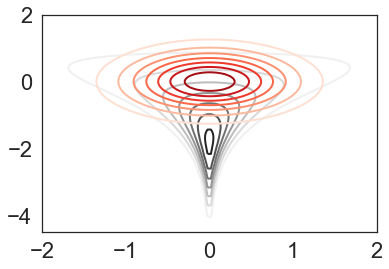

#  viabel: *V*ariational *I*nference and *A*pproximation *B*ounds that is *E*fficient and *L*ightweight [](https://travis-ci.org/jhuggins/viabel) [](https://codecov.io/gh/jhuggins/viabel)

[**Quickstart (variational inference)**](#quickstart-for-variational-inference)
| [**Quickstart (error bounds)**](#quickstart-for-error-bounds)
| [**Install guide**](#installation)

*viabel* provides two types of functionality:

1. A lightweight, flexible set of methods for variational inference that is
agnostic to how the model is constructed. All that is required is a log
density and its gradient.
2. Methods for computing bounds on the errors of the mean, standard deviation,
and variance estimates produced by a continuous approximation to an
(unnormalized) distribution.
A canonical application is a variational approximation to a Bayesian posterior
distribution.

## Quickstart for Variational inference

viabel currently supports both standard KL-based variational inference (KLVI)
and chi-squared variational inference (CHIVI).
Models are provided as `autograd`-compatible log densities or can be constructed
from `pystan` fit objects.
As a simple example, we consider Neal's funnel distribution in 2 dimensions so
that we can visualize the results.
```python
import autograd.numpy as np
import autograd.scipy.stats.norm as norm

D = 2  # number of dimensions
log_sigma_stdev = 1.35
def log_density(x):
    mu, log_sigma = x[:, 0], x[:, 1]
    sigma_density = norm.logpdf(log_sigma, 0, log_sigma_stdev)
    mu_density = norm.logpdf(mu, 0, np.exp(log_sigma))
    return sigma_density + mu_density
```
We will use mean-field t distributions as the variational family:
```python
from viabel.family import mean_field_t_variational_family
var_family = mean_field_t_variational_family(D, 40)
```
The variational objective is (standard) exclusive KL-divergence (i.e., the ELBO)
with unbiased reparameterization gradients:
```python
from viabel.objectives import black_box_klvi
# number of Monte Carlo samples for estimating gradients
num_mc_samples = 100   
# function that returns an unbiased estimate of the objective and its gradient
vi_objective_and_grad = black_box_klvi(var_family, log_density, num_mc_samples)
```

The variational objective can be optimized using a windowed version of adagrad:
```python
init_var_param = np.zeros(var_family.var_param_dim)
n_iters = 2500
# var_param is the estimated optimal variational parameter using iterate averaging
var_param, _, _, _ = adagrad_optimize(n_iters, vi_objective_and_grad, init_var_param, learning_rate=.01)
```

In this case, the resulting variational approximation (red) of the
funnel distribution (black) is not particularly good.




## Quickstart for Error Bounds

The error bounds are based on samples from the approximation *Q* and evaluations
of the (maybe unnormalized) log densities of *Q* and the target distribution *P*.
In particular, you can compute bounds on:

* the &alpha;-divergence between *P* and *Q*
* the *p*-Wasserstein distance between *P* and *Q*
* the differences between the means, standard deviations, and variances of *P* and *Q*


## Installation

You can install the latest stable version using `pip install viabel`.
If you want to run all of the [example notebooks](notebooks),
use the command `pip install viabel[examples]`, which will install additional
dependencies.

## Citing viabel

If you use this package, please cite:

[Validated Variational Inference via Practical Posterior Error Bounds](https://arxiv.org/abs/1910.04102).
Jonathan H. Huggins,
Miko&#0322;aj Kasprzak,
Trevor Campbell,
Tamara Broderick.
In *Proc. of the 23rd International Conference on Artificial Intelligence and
Statistics* (AISTATS), Palermo, Italy. PMLR: Volume 108, 2020.

The equivalent BibTeX entry is:
```
@inproceedings{Huggins:2020:VI,
author = {Huggins, Jonathan H and Kasprzak, Miko&#0322;aj and Campbell, Trevor and Broderick, Tamara},
title = {{Validated Variational Inference via Practical Posterior Error Bounds}},
booktitle = {Proc. of the 23rd International Conference on Artificial Intelligence and
Statistics (AISTATS)},
year = {2020}
}
```

## Usage Examples

The [normal mixture notebook](notebooks/normal-mixture.ipynb) provides basic
usage examples of the bounds.

The [robust regression example](notebooks/robust-regression.ipynb) demonstrates
how to use the variational Bayes functionality and then compute bounds.

## Running Comparison Experiments

The [notebooks/experiments.py](notebooks/experiments.py) contains additional
functionality for running experiments and computing PSIS-corrected posterior estimates.
The [robust regression example](notebooks/robust-regression.ipynb) uses some of this functionality.
A simple [funnel distribution example](notebooks/funnel-distribution.ipynb) demonstrates how to use the high-level `run_experiment` function.
The [eight schools example](notebooks/eight-schools.ipynb) is more involved and realistic.
